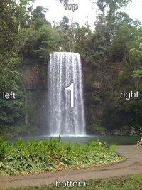

# Image Resize API

### Setup development environment
http://golang.org/doc/install

TLTR:

1. `wget http://golang.org/dl/go1.3.linux-amd64.tar.gz`
2. `sudo tar -C /usr/local -xzf go1.3.linux-amd64.tar.gz`
3. `export PATH=$PATH:/usr/local/go/bin`
4. `export GOPATH=$HOME/go`
5. `export PATH=$PATH:$GOPATH/bin`

### Compile

- go build

### Usage
#### Config file

```json
{
    "TempDir": "/tmp/",
    "LogTo": "/tmp/resizer.log",
    "JpegQuality": 70,
    "SharpenSigma": 3.0
}

```

#### SYNOPSIS
    image-api [OPTIONS]
#### OPTIONS
    -p port, default 8001
    -c config file, default config.json

### APIs
- POST /api/resize

```python

payload = {
    "width": 200,
    "method": "square",
}
files = {
    "file": open("/tmp/exif-orientation-examples/Portrait_1.jpg", "rb"),
}
resp = requests.post("http://0.0.0.0:8001/api/resize", data=payload, files=files)
if resp.status_code == 200:
    with open("/tmp/dst.jpg", "wb") as f:
        [f.write(c) for c in resp.iter_content()]
```

### Features
- Resizer
  - [X] exif standard Rotation
  - [X] Sharpen
  - [X] Square
  - [X] Width
  - [X] Auto

### Performance
- Resizer
  - Hardware:
    - 6 core
    - 9 GB memeory

  - Speed:

  ```
      127.0.0.1 - - [29/Aug/2014:14:25:47 -0400] "POST /api/resize HTTP/1.1" 200 28504 102982
      127.0.0.1 - - [29/Aug/2014:14:25:47 -0400] "POST /api/resize HTTP/1.1" 200 2698 65584
      127.0.0.1 - - [29/Aug/2014:14:25:47 -0400] "POST /api/resize HTTP/1.1" 200 4649 57456
      127.0.0.1 - - [29/Aug/2014:14:25:47 -0400] "POST /api/resize HTTP/1.1" 200 15060 73440
      127.0.0.1 - - [29/Aug/2014:14:25:47 -0400] "POST /api/resize HTTP/1.1" 200 22742 74628
      127.0.0.1 - - [29/Aug/2014:14:25:47 -0400] "POST /api/resize HTTP/1.1" 200 94149 135495
      127.0.0.1 - - [29/Aug/2014:14:25:48 -0400] "POST /api/resize HTTP/1.1" 200 25735 78755
      127.0.0.1 - - [29/Aug/2014:14:25:48 -0400] "POST /api/resize HTTP/1.1" 200 2466 56197
      127.0.0.1 - - [29/Aug/2014:14:25:48 -0400] "POST /api/resize HTTP/1.1" 200 4225 44249
      127.0.0.1 - - [29/Aug/2014:14:25:48 -0400] "POST /api/resize HTTP/1.1" 200 13410 74348
      127.0.0.1 - - [29/Aug/2014:14:25:48 -0400] "POST /api/resize HTTP/1.1" 200 35278 95109
      127.0.0.1 - - [29/Aug/2014:14:25:48 -0400] "POST /api/resize HTTP/1.1" 200 86743 160845
      127.0.0.1 - - [29/Aug/2014:14:25:48 -0400] "POST /api/resize HTTP/1.1" 200 25614 88795
      127.0.0.1 - - [29/Aug/2014:14:25:48 -0400] "POST /api/resize HTTP/1.1" 200 2449 52324
      127.0.0.1 - - [29/Aug/2014:14:25:48 -0400] "POST /api/resize HTTP/1.1" 200 4221 61806
      127.0.0.1 - - [29/Aug/2014:14:25:48 -0400] "POST /api/resize HTTP/1.1" 200 13382 71425
      127.0.0.1 - - [29/Aug/2014:14:25:49 -0400] "POST /api/resize HTTP/1.1" 200 35086 127063
      127.0.0.1 - - [29/Aug/2014:14:25:49 -0400] "POST /api/resize HTTP/1.1" 200 81301 131190
      127.0.0.1 - - [29/Aug/2014:14:25:49 -0400] "POST /api/resize HTTP/1.1" 200 28195 94631
      127.0.0.1 - - [29/Aug/2014:14:25:49 -0400] "POST /api/resize HTTP/1.1" 200 2689 42894
      127.0.0.1 - - [29/Aug/2014:14:25:49 -0400] "POST /api/resize HTTP/1.1" 200 4658 57997
      127.0.0.1 - - [29/Aug/2014:14:25:49 -0400] "POST /api/resize HTTP/1.1" 200 14938 75800
      127.0.0.1 - - [29/Aug/2014:14:25:49 -0400] "POST /api/resize HTTP/1.1" 200 22243 77676
      127.0.0.1 - - [29/Aug/2014:14:25:49 -0400] "POST /api/resize HTTP/1.1" 200 89796 130479
      127.0.0.1 - - [29/Aug/2014:14:25:49 -0400] "POST /api/resize HTTP/1.1" 200 28043 92493
      127.0.0.1 - - [29/Aug/2014:14:25:50 -0400] "POST /api/resize HTTP/1.1" 200 2676 55859
      127.0.0.1 - - [29/Aug/2014:14:25:50 -0400] "POST /api/resize HTTP/1.1" 200 4632 58250
      127.0.0.1 - - [29/Aug/2014:14:25:50 -0400] "POST /api/resize HTTP/1.1" 200 14846 64591
      127.0.0.1 - - [29/Aug/2014:14:25:50 -0400] "POST /api/resize HTTP/1.1" 200 22133 91448
  ```

  - exif orientation Test (https://github.com/recurser/exif-orientation-examples)

           

           


